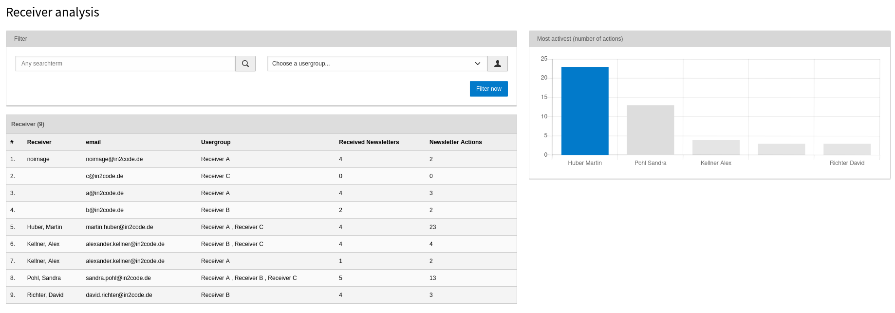

# Luxletter - Email marketing in TYPO3. Send newsletters the easy way.

## TYPO3 Dashboard Module

In addition to the build in dashboard, since TYPO3 10 it is possible to install another dashboard for system wide
diagrams in TYPO3.
You could do this simply with `composer require typo3/cms-dashboard`. Once it is available, you can add some widgets
from Lux.

This is a screenshot from default values:

## Analyses

As soon as you will open the luxletter module, you will see an analyses dashboard that helps you to get a feeling
how your newsletters perform.

| Field           | Description                                                             |
|-----------------|-------------------------------------------------------------------------|
| Receiver        | See the current number of different receivers all over your newsletters |
| Openrate        | How many mails are opened compared to the overall dispatched mails      |
| Clickrate       | How many clicks are generated compared to the overall openrate          |
| Unsubscriberate | How many unsubscribes are generated compared to the overall openrate    |
| Open            | See an open statistic of the last sent newsletters                      |
| Newsletter      | See the last sent newsletters with the analysis data                    |
| Click           | See a click statistic of the last sent newsletters                      |
| Links           | See the most clicked links of all your newsletters                      |

## Receiver

If you switch to the `Receiver` view, a preview is shown if you don't have the extension lux installed.

**Note** You can turn off the view in the extension settings

If you have also lux installed, this view gives you some interesting insights into your receiver activities.

### Left column

You will see a list of all your receivers with the number of already received newsletters and the number of actions
of this receiver (a click or an open of a newsletter is an action).
A filter on the top helps you to search for a specific user or to list all users of a given usergroup.

### Right column

#### First box

At the beginning you will see the users with the most activities on the right column. But as soon as you click on a
line within the left column, you will see some more details of a chosen receiver.

It's beginning with some information of the user itself. Probably an image is shown (if there is an image in the
frontendusers record or if there is a gravatar image to the email address).

The button `Show lead details` will help you to see even more details in the lux lead view of this user.

#### Second box

On the left you will see a list of newsletter activities of the user (even if the user is not yet identified in lux).
An activity is if the user clicks a link in a newsletter e.g.

**Note** Mouseover over an activitiy will show you the exact time of this action

On the right you will see a list of website activities of the user (but only if the user is already identified in lux -
see the lux documentation for more details what identification means and how you can identify a visitor).

**Note** Mouseover over the time on the right will show you the exact time of this action
