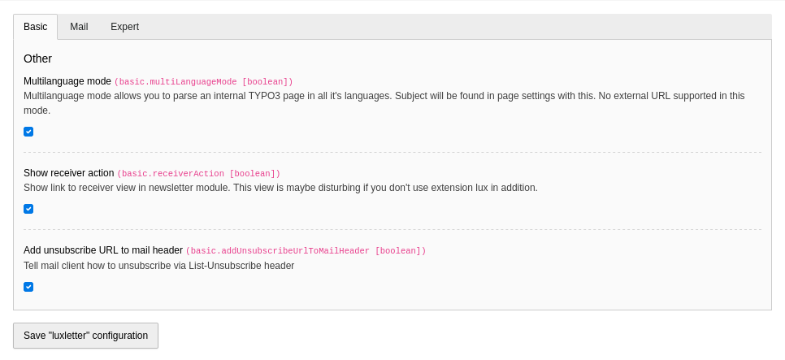
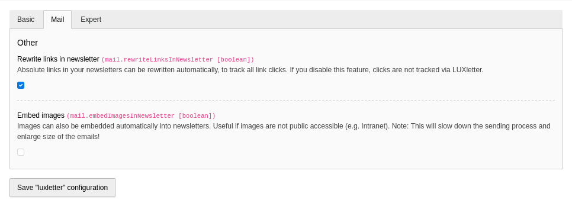
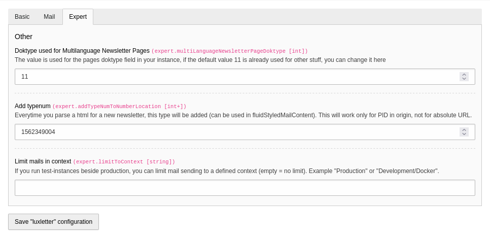
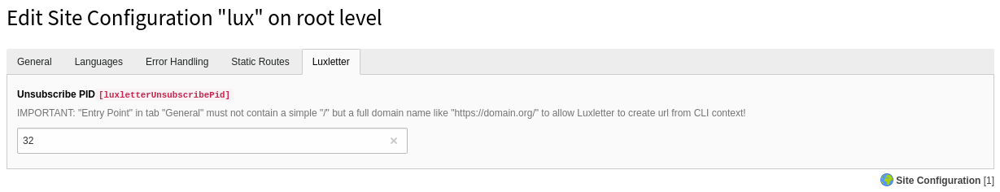
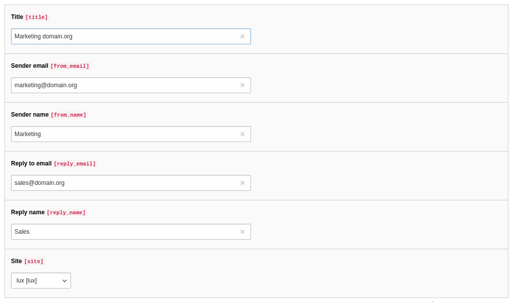
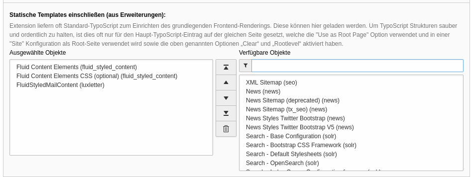
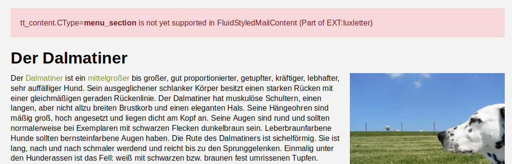
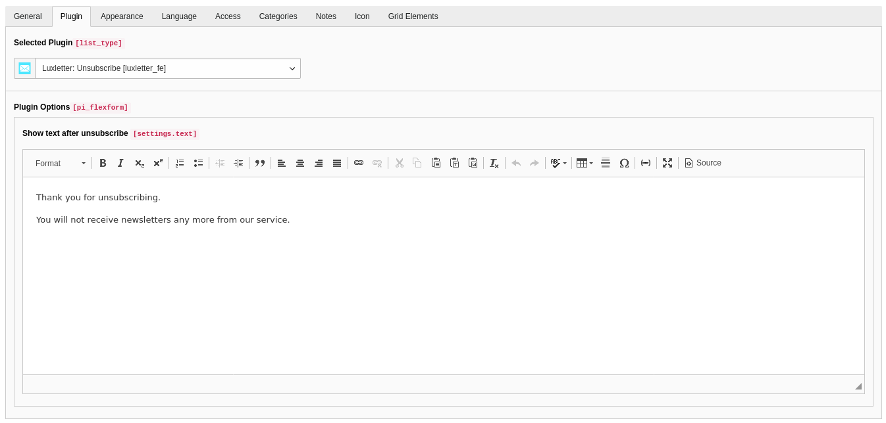
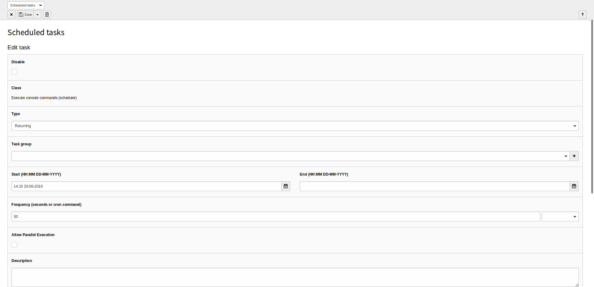
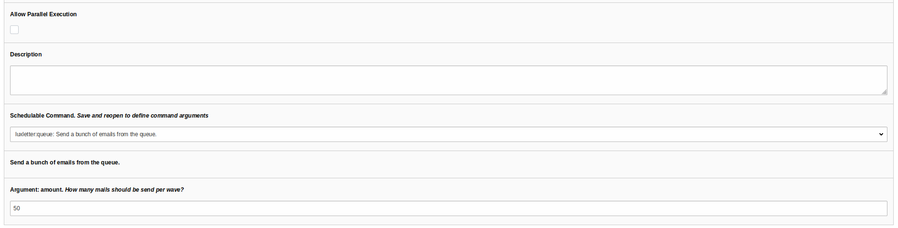

# Luxletter - Email marketing in TYPO3

Send newsletters the easy way

## Installation

Extension luxletter should be installed via composer

```
composer require "in2code/luxletter"
```

**Note:** TYPO3 in composer mode is needed

TYPO3 11.5 or 12.4 is required. The free extension lux can be also installed for more analysis but is not necessary.


### Basic settings in extension configuration

| Field                         | Default value | Description                                                                                                                                                                                                                                         |
|-------------------------------|---------------|-----------------------------------------------------------------------------------------------------------------------------------------------------------------------------------------------------------------------------------------------------|
| Multilanguage mode            | 0             | This mode allows to parse pages with all localized versions. No external sources can be parsed in multilanguage mode - only internal pages.                                                                                                         |
| Show receiver action          | 1             | Show receiver action: Show link to receiver view in newsletter module. This view is maybe disturbing if you don't use extension lux in addition.                                                                                                    |
| Add unsubscribe URL to header | 1             | Add unsubscribe URL to mail header: Tell mail client how to unsubscribe via List-Unsubscribe header.                                                                                                                                                |
| Rewrite links in newsletter   | 1             | Rewrite links in newsletter: Absolute links in your newsletters can be rewritten automatically, to track all link clicks. If you disable this feature, clicks are not tracked.                                                                      |
| Embed images                  | 0             | Images with absolute url can automatically be embedded into newsletter mails. File will be stored temporary under `uploads/tx_luxletter/` when newsletters are generated. Attention: This will slow down the sending process (about 10s per email). |
| Doktype for Multilanguage     | 11            | The value is used for the pages doktype field in your instance, if the default value 11 is already used for other stuff, you can change it here.                                                                                                    |
| Add typenum                   | 1562349004    | Add typenum: Everytime you parse a html for a new newsletter, this type will be added (can be used in fluidStyledMailContent). This will work only for PID in origin, not for absolute URL.                                                         |
| Limit mails in context        |               | Limit mails in context: If you run testinstances beside production, you can limit mail sending to a defined context (empty = no limit). Example "Production" or "Development/Docker".                                                               |








### Site configuration

You must define one unsubscribe pid per site configuration. This is relevant the unsubscribe plugin of luxletter. You
can also use a pid outside the site or simply use one unsubscribe page for multiple sites. Nevertheless the PID must
be defined in every site configuration.

**Attention** Be aware to use a full domain name in base (Entry point) settings of your site configuration. Good: `https://www.domain.org/` - Bad: `/`




### Sender configuration

A sender configuration can be added via list module in every folder page in backend.

| Field          | Description                                                                                          |
|----------------|------------------------------------------------------------------------------------------------------|
| Title          | Your internal title for this sender configuration                                                    |
| Sender email   | Sender email address for newsletter email                                                            |
| Sender name    | Sender name for newsletter email                                                                     |
| Reply to email | Email address when a receiver wants to send an answer to the newsletter                              |
| Reply to name  | Name when a receiver wants to send an answer to the newsletter                                       |
| Site           | This defines your domain/site and is needed for the unsubscribe plugin and for building absolute URI |




### TypoScript

Basicly there are two different TypoScripts that should be included in static templates in your root template

* Static template `Basic TypoScript` must be included for basic settings
* In addition `FluidStyledMailContent` static template can also be added for rendering content in an email way (with html from the hell for outlook & co.)



**Important** Please do not include those templates in an extension template deep in your website but on the root template. Otherwise the backend module can't read the TypoScript.

#### Basic

The basic Typoscript is splitted into some files (see Folders and files in EXT:luxletter/Configuration/TypoScript/Basic/*)

#### FluidStyledMailContent

This TypoScript can be found on EXT:luxletter/Configuration/TypoScript/FluidStyledMailContent/

As soon as a page is opened with `&type=1562349004` the same content should be shown but with some very ugly markup.
Tables and oldschool stuff helps to create newsletters for old email clients like Outlook 200? and so on.

**Note** Not all content elements are supported. If there is a content element that could not be rendered the old way, a
message will show you the state in frontend.



**Note** If you want to overwrite the default rendering of FluidStyledMailContent output, have a look at the folder
EXT:lux/Resources/Private/FluidStyledMailContent/ and overwrite the path in your own extension.


### Add page for a unsubscribe plugin

Of course there is a unsubscribe plugin build in into luxletter. Create a new page that is accessable for
normal website users (can be disabled in menus) and add a plugin of type `Luxletter: unsubscribe` on it.

Don't forget to add the page identifier to the main extension settings (see above) after that.



* In addition you can add a message that should appear if a user just unsubscribed.

Technical note: if someone unsubscribes from a newsletter, luxletter will simply remove the receiver usergroup from
this user. The user is not deleted from the system.

**Note** Unsubscribing is only possible if a hash is added to the link call.
See `{luxletter:mail.getUnsubscribeUrl(newsletter:newsletter,user:user,site:site)}` in the newsletter layout
on EXT:lux/Resources/Private/Templates/Mail/NewsletterContainer.html


### Define fe_groups records for receiver groups

Luxletter needs fe_users records with valid email addresses to send newsletters. And TYPO3 needs you to set
a usergroup (or some usergroups) per frontenduser.
And luxletter allows you to send newsletters to frontendusers of defined groups.
Open a group and check `Is newsletter receiver group` for groups that should get newsletters in future.


### Define fe_users.luxletter_language (only for multilanguage mode)

If luxletter runs in multilanguage mode, you can define which fe_user record prefers which language. Just open
such a record and select a specific value for field `luxletter_language`.


### Connect a mailserver

If you don't set a mail configuration for luxletter,
the default mail configuration from TYPO3 will be used when sending newsletters.

Nevertheless it's highly recommended to set a different mailserver for your newsletter configuration to prevent
that your complete server will be marked as spam on some cases.
Such settings can simply be done in your typo3conf/AdditionalConfiguration.php file like:

```
$GLOBALS['TYPO3_CONF_VARS']['MAIL_LUXLETTER']['transport'] = 'smtp';
$GLOBALS['TYPO3_CONF_VARS']['MAIL_LUXLETTER']['transport_smtp_server'] = 'sslout.de:465';
$GLOBALS['TYPO3_CONF_VARS']['MAIL_LUXLETTER']['transport_smtp_encrypt'] = 'ssl';
$GLOBALS['TYPO3_CONF_VARS']['MAIL_LUXLETTER']['transport_smtp_username'] = 'username';
$GLOBALS['TYPO3_CONF_VARS']['MAIL_LUXLETTER']['transport_smtp_password'] = 'password';
$GLOBALS['TYPO3_CONF_VARS']['MAIL_LUXLETTER']['transport_smtp_port'] = '465';
```

**Note** All default mail configurations of TYPO3 can be used but the key would be `MAIL_LUXLETTER` now.


### Configure the queue task

If you add newsletters, they will be parsed and saved as `ready for dispatch` into a queue table.
This queue has to be processed step by step and you could use the scheduler backend module for this task.

#### Scheduler task

Just add a new task of type `Execute console commands (scheduler)`. After that, you can select
`luxletter:queue: Send a bunch of emails from the queue`. A new field will appear
`How many mails should be send per wave?`. This number allows you to send X email at once to the mailserver.

**Note** Be careful and don't set this number too high to keep the mailserver save. A number between 50 and 250 is a
good solution.

**Note** If your TYPO3-Backend is getting locked after using the scheduler-task, delete the file "LOCK_BACKEND" in typo3conf and be sure to have set the correct "Schedulable Command". BTW: If you forgot to set "Frequency" initially, TYPO3 sets the Command back to "backend:lock".




#### CLI

As an alternative, you could also process the queue directly from the console:

```
# Send 50 newsletters that are queued
./vendor/bin/typo3 luxletter:queue

# Send a specific number of newsletters from queue
./vendor/bin/typo3cms luxletter:queue 10

# Send some queued newsletters from newsletter with uid 123
./vendor/bin/typo3cms luxletter:queue 10 123
```

