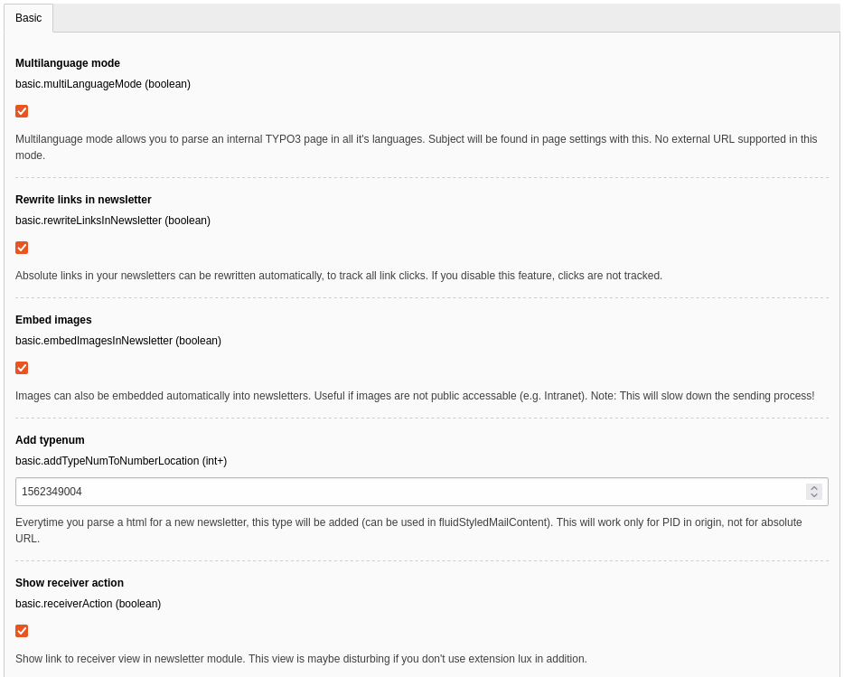

# Luxletter - Email marketing in TYPO3. Send newsletters the easy way.

## Installation

Extension luxletter should be installed via composer

```
composer require "in2code/luxletter"
```

Note: Installation without composer could work but is not supported. 
TYPO3 9.5 is required. The free extension lux can be also installed for more analysis but is not 
neccessary.


### Basic settings in extension configuration

| Field                         | Default value                 | Description                                                                             |
| ----------------------------- | ----------------------------- | --------------------------------------------------------------------------------------- |
| Webserver domain              | https://www.domain.org        | Domain for the rendering of the newsletter in frontend. Normally your current domain.   |
| Unsubscribe PID               | 6                             | Where is your unsubscribe plugin located on your website?                               |
| Rewrite links in newsletter   | 1                             | Do you want to track if a receiver opens a link? Then you have to check this option.    |
| Add typenum                   | 1562349004                    | Default typenum if content of your website should be rendered in an email view.         |
| Show receiver action          | 1                             | Disable the link to the receiver action if you don't need it.                           |
| Sender email address          | newsletter@yourserver.org     | Define a sender email address for your newsletters.                                     |
| Sender name                   | Sender name                   | Define a sender name for your newsletters.                                              |
| Reply email address           | personal@youremail.org        | Real email address of a person that should receive answers to this newsletter email.    |
| Sender name                   | Sender name                   | Name of the sender for your newsletter (mostly the same as fromName).                   |




### TypoScript

Basicly there are two different TypoScripts that should be included in static templates in your root template

* Static template `Basic TypoScript` must be included for basic settings
* In addition `FluidStyledMailContent` static template can also be added for rendering content in an email way (with html from the hell for outlook & co.)


#### Basic

The basic Typoscript is splitted into some files (see Folders and files in EXT:luxletter/Configuration/TypoScript/Basic/*)

#### FluidStyledMailContent

This TypoScript can be found on EXT:luxletter/Configuration/TypoScript/FluidStyledMailContent/

As soon as a page is opened with `&type=1562349004` the same content should be shown but with some very ugly markup.
Tables and oldschool stuff helps to create newsletters for old email clients like Outlook 200? and so on.

**Note** Not all content elements are supported. If there is a content element that could not be rendered the old way, a
message will show you the state in frontend.


**Note** If you want to overwrite the default rendering of FluidStyledMailContent output, have a look at the folder
EXT:lux/Resources/Private/FluidStyledMailContent/ and overwrite the path in your own extension.


### Add page for a unsubscribe plugin

Of course there is a unsubscribe plugin build in into luxletter. Create a new page that is accessable for
normal website users (can be disabled in menus) and add a plugin of type `Luxletter: unsubscribe` on it.

Don't forget to add the page identifier to the main extension settings (see above) after that.


* You should select a usergroup that should be removed from the current visiting frontenduser.
* In addition you can add a message that should appear if a user just unsubscribed.

**Note** Unsubscribing is only possible if a hash is added to the link call. 
See `{luxletter:mail.getUnsubscribeUrl(newsletter:newsletter,user:user)}` in the newsletter layout 
on EXT:lux/Resources/Private/Templates/Mail/NewsletterContainer.html


### Define fe_groups records for receiver groups

Luxletter needs fe_users records with valid email addresses to send newsletters. And TYPO3 needs you to set
a usergroup (or some usergroups) per frontenduser.
And luxletter allows you to send newsletters to frontendusers of defined groups.
Open a group and check `Is newsletter receiver group` for groups that should get newsletters in future.


### Connect a mailserver

If you don't set a mail configuration for luxletter, 
the default mail configuration from TYPO3 will be used when sending newsletters.

Nevertheless it's highly recommended to set a different mailserver for your newsletter configuration to prevent
that your complete server will be marked as spam on some cases.
Such settings can simply be done in your typo3conf/AdditionalConfiguration.php file like:

```
$GLOBALS['TYPO3_CONF_VARS']['MAIL_LUXLETTER']['transport'] = 'smtp';
$GLOBALS['TYPO3_CONF_VARS']['MAIL_LUXLETTER']['transport_smtp_server'] = 'sslout.de:465';
$GLOBALS['TYPO3_CONF_VARS']['MAIL_LUXLETTER']['transport_smtp_encrypt'] = 'ssl';
$GLOBALS['TYPO3_CONF_VARS']['MAIL_LUXLETTER']['transport_smtp_username'] = 'username';
$GLOBALS['TYPO3_CONF_VARS']['MAIL_LUXLETTER']['transport_smtp_password'] = 'password';
$GLOBALS['TYPO3_CONF_VARS']['MAIL_LUXLETTER']['transport_smtp_port'] = '465';
```

**Note** All default mail configurations of TYPO3 can be used but the key would be `MAIL_LUXLETTER` now.


### Configure the queue task

If you add newsletters, they will be parsed and saved as `ready for dispatch` into a queue table.
This queue has to be processed step by step and you could use the scheduler backend module for this task.

#### Scheduler task

Just add a new task of type `Execute console commands (scheduler)`. After that, you can select
`luxletter:queue: Send a bunch of emails from the queue`. A new field will appear
`How many mails should be send per wave?`. This number allows you to send X email at once to the mailserver.

**Note** Be careful and don't set this number too high to keep the mailserver save. A number between 50 and 250 is a
good solution.

**Note** If your TYPO3-Backend is getting locked after using the scheduler-task, delete the file "LOCK_BACKEND" in typo3conf and be sure to have set the correct "Schedulable Command". BTW: If you forgot to set "Frequency" initially, TYPO3 sets the Command back to "backend:lock".


#### CLI

As an alternative, you could also process the queue directly from the console:

```
# Send 50 newsletters that are queued
./vendor/bin/typo3 luxletter:queue

# Send a specific number of newsletters from queue
./vendor/bin/typo3cms luxletter:queue 10

# Send some queued newsletters from newsletter with uid 123
./vendor/bin/typo3cms luxletter:queue 10 123
```

