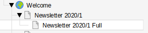
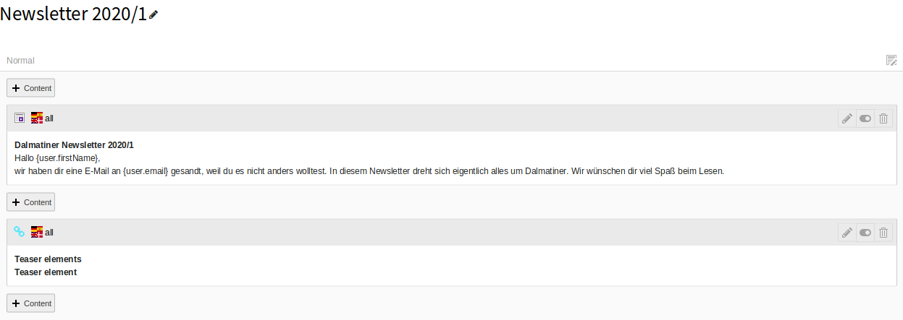
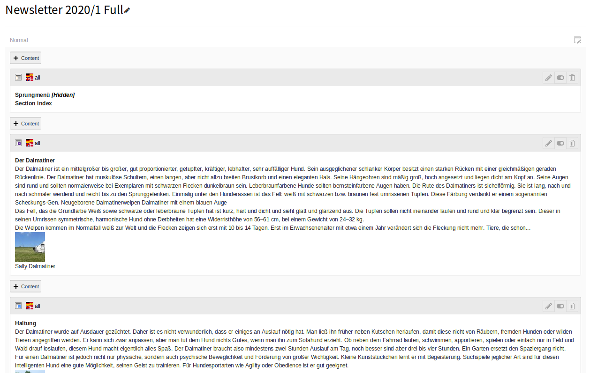
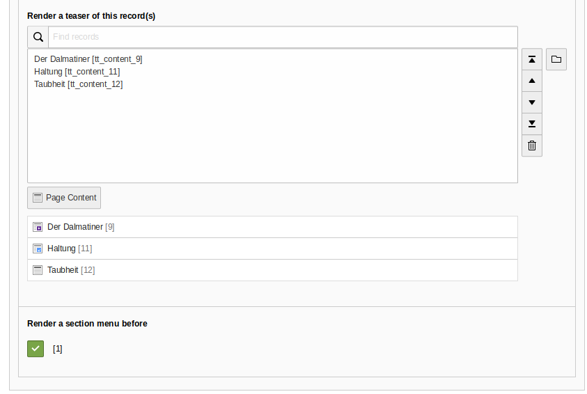
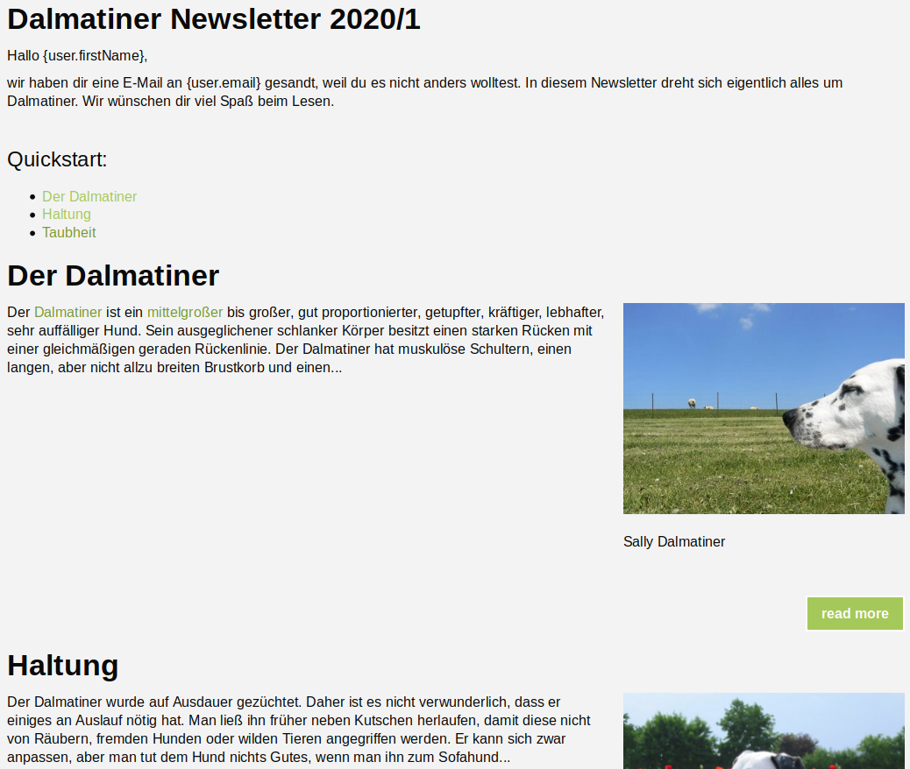
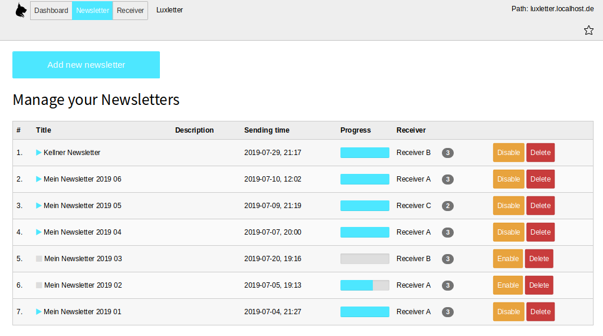

# Luxletter - Email marketing in TYPO3. Send newsletters the easy way.


## Creating newsletters

The basic component to create newsletters in luxletter is to build a HTML-output of the
newsletter core first.
That could be any website of course or - of course - the current TYPO3 website.

A newsletter should be motivate the receiver to click a link to see even more information.
The reason is simple: On the one hand, it's better to teaser content elements, so the
receiver is able to scroll to the interesting content. On the other hand, in marketing
automation, a click on a link leads to an identification.

And last but not least you can see which content is the most interesting content for further
newsletters.


### Creating newsletters with TYPO3 content elements

#### Page structure

You could create two pages. The outer page should contain teaser elements with links to the
full newsletter text elements on a subpage.

Example pagetree:



Example teaser page content:



You could build your own teaser elements with single content elements or with the content element
`Teaser element` build in in Luxletter.

Example full page content:



This is a page with some content elements. Every element is a newsletter content.

**Note** You can use variables in your content that should be filled with fe_users.* field values. So
a `{user.lastName}` will be filled with the individual lastname of the user when the mail is sent.

**Note** Only the part between the opening and the ending body-tag will be parsed into the newsletter.

**Note** It's of course up to you how you build your newsletters and the technique behind
(TYPO3 with Content Elements on one page, TYPO3 with Content Elements on different pages, TYPO3 with
a news plugin, etc...)


#### Teaser content elements

If you add a content element of type `Teaser element` to your outer page, you can select single
content elements that you will teaser automatically.

| Field                                    | Description                                                                             |
| ---------------------------------------- | --------------------------------------------------------------------------------------- |
| Show maximum number of characters        | Automaticly crop text after this number of characters                                   |
| Append this characters                   | Add this characters after the cropped text                                              |
| Choose a text for the "read more" button | Text for the read more button                                                           |
| Render a teaser of this record(s)        | Choose some content elments that you want to teaser                                     |
| Render a section menu before             | Check this for a automaticly build jump-menu                                            |




**Technical note** It's not that easy to build such a function without rewriting every content element
markup again. So the teasered text is searched in an element with the class `ce-bodytext` per default.
See ViewHelper `luxletter:format.cropyBySelection` for more details and options.


#### The ugly way

If you are not that well versed in newsletter technologies, you may wondering yourself how the HTML
should be build that mails can be shown in a large bunch of email clients.
Looking back in the past, the Microsoft guys for Outlook used the Internet Explorer engine to render mails.
And if you think that was a bad idea, wait what they did some times later. Now (no joke) Microsoft Word
is the rendering engine for Outlook.

Long story short: Look at https://get.foundation/emails/docs/ for some responsive
Email templates. Those templates are build with HTML from the 90ies.

But if you are looking at the page that you build for your newsletter content, you will see some HTML5
and some DIV stuff. Nothing what will be accepted by Outlook and Co.

But luxletter will render your content again with TABLE-mechanism if you are adding the typenum
`&type=1562349004` to the URL in the frontend.

Example output:


**Note** Typenum routing should be defined in the configuration. Example:

```
routeEnhancers:
  PageTypeSuffix:
    type: PageType
    default: /
    index: ''
    suffix: /
    map:
      newsletter.html: 1562349004
```


#### Zurb foundation and Newsletter wrapping

You can focus your website content on the introduction and the useful content itself. Luxletter uses a wrapping
service to wrap your content with header and footer automatically.
Look at `EXT:luxletter/Resources/Private/Templates/Mail/NewsletterContainer.html` to see the HTML that
is used for the wrapping of the header and footer.
The variable `{content}` will be filled with your built content when creating newsletter records (see
next chapter).

Of course you can overwrite this template file in your extension in the known way like in other extension.

```
plugin {
    tx_luxletter_fe {
        view {
            templateRootPaths {
                2 = EXT:yoursitepackage/Resources/Private/Templates/Extensions/Luxletter/
            }
            partialRootPaths {
                2 = EXT:yoursitepackage/Resources/Private/Partials/Extensions/Luxletter/
            }
            layoutRootPaths {
                2 = EXT:yoursitepackage/Resources/Private/Layouts/Extensions/Luxletter/
            }
        }
    }
}
module {
    tx_luxletter {
        view {
            templateRootPaths {
                2 = EXT:yoursitepackage/Resources/Private/Templates/Extensions/Luxletter/
            }
            partialRootPaths {
                2 = EXT:yoursitepackage/Resources/Private/Partials/Extensions/Luxletter/
            }
            layoutRootPaths {
                2 = EXT:yoursitepackage/Resources/Private/Layouts/Extensions/Luxletter/
            }
        }
    }
}
```

**Note:** If you change the path via TypoScript extension template, please take care that you are using the very first
template on root (otherwise the paths could not be recognized by the backend module or CLI calls)

The existing template is using the **Zurb Foundation email template**
(see https://get.foundation/emails/docs/ for details)

**Note** There is also an unsubscribe link in the footer - look for
`<f:link.external uri="{luxletter:mail.getUnsubscribeUrl(newsletter:newsletter,user:user,site:site)}" additionalAttributes="{data-luxletter-parselink:'false'}">Unsubscribe now</f:link.external>`

**Note** Normally links in luxletter should be rewritten, so clicks can be tracked. But in some
cases you don't want to rewrite all links. Some should not be rewritten. Just add an attribute
`data-luxletter-parselink="false"` to the link.


#### Inline CSS

Because some webmail clients are removing style-tags, we offer a possibility to render css inline in the html-tags.
You can define local CSS files in this way (higher numbers are overwriting lower numbers):

```
plugin {
  tx_luxletter_fe {
    settings {
      addInlineCss {
        0 = EXT:luxletter/Resources/Private/Css/ZurbFoundation.css
        1 = EXT:luxletter/Resources/Private/Css/Luxletter.css
      }
    }
  }
}
```

### Creating newsletters in the backend module

Now, when your content is ready to be parsed, you can add new newsletter records. Simply open
the luxletter backend module and switch from `Dashboard` to `Newsletter` view.

If you already have built some newsletters, you will see a list of existing records. Otherwise you
can only add new records.

#### List view

| Field                   | Description                                                                             |
| ----------------------- | --------------------------------------------------------------------------------------- |
| #                       | Newsletter number                                                                       |
| Title                   | Newsletter title                                                                        |
| Description             | Newsletter description                                                                  |
| Sending time            | Time when the newsletter can be send                                                    |
| Progress                | Sending progress of the newsletter                                                      |
| Receiver                | Receiver frontenduser group with the number of receivers                                |
| Disable                 | Disable this newsletter. The newsletter will not be sent any more when disabled.        |
| Delete                  | Delete this newsletter and all related queue entries                                    |



#### Add new newsletters

Clicking on `Add new newsletter` starts a process where you can create new newsletter records.


| Field                   | Description                                                                             |
| ----------------------- | --------------------------------------------------------------------------------------- |
| Newsletter title        | Add a useful title to your newsletter                                                   |
| Newsletter start        | If you select a start time (optional), newsletters will not be send before this time    |
| Description             | Add a useful title to your newsletter                                                   |


| Field                   | Description                                                                             |
| ----------------------- | --------------------------------------------------------------------------------------- |
| Sender                  | Choose a sender record                                                                  |
| Receiver                | Choose a receiver group (frontenduser groups that marked as luxletter groups)           |
| Mail subject            | Mail subject (also variables are allowed like {user.lastName}                           |
| Newsletter location     | Choose where your HTML for the newsletter is located. An absolute URL like https://domain.org/newsletter.html is possible. If you add a number (PID), the page will be parsed (typenum is automaticly added) |


| Field                   | Description                                                                                      |
| ----------------------- | ------------------------------------------------------------------------------------------------ |
| Test email address      | Send a quick testmail to an email (variables in the newsletter will be filled with dummy values) |
| Receivers preview       | Add small preview of your receivers will help you to be sure you haven chosen the correct group  |
| Newsletter preview      | You will see a newsletter preview (variables will be filled with dummy values)                   |

As soon as you save the newsletter, it will be parsed and after that it's ready for the dispatch.
