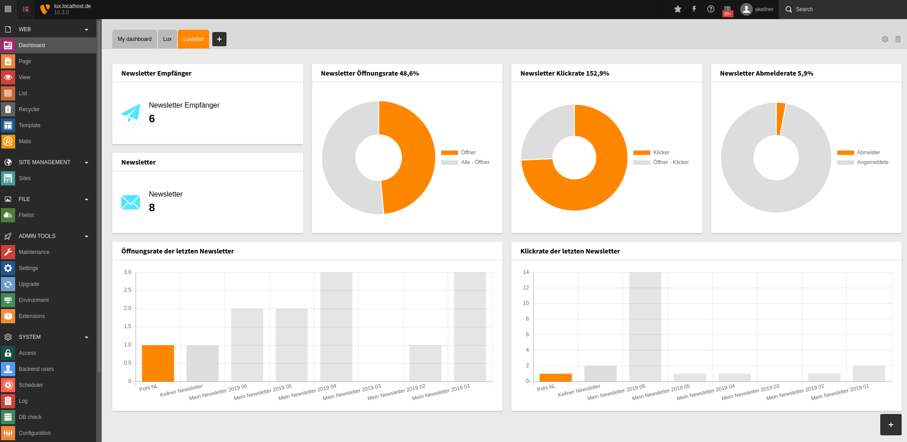
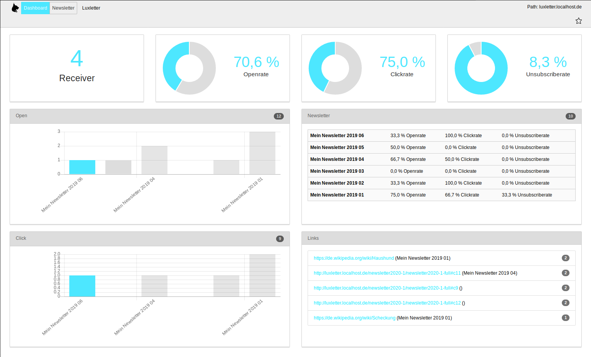
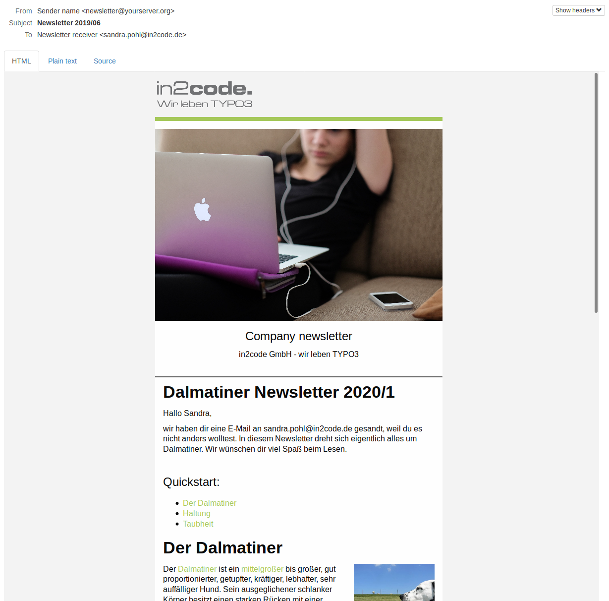
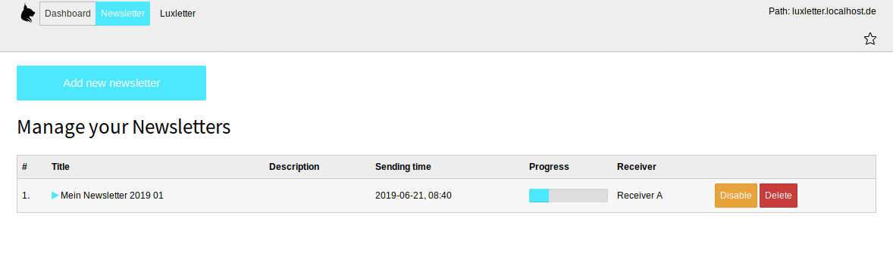
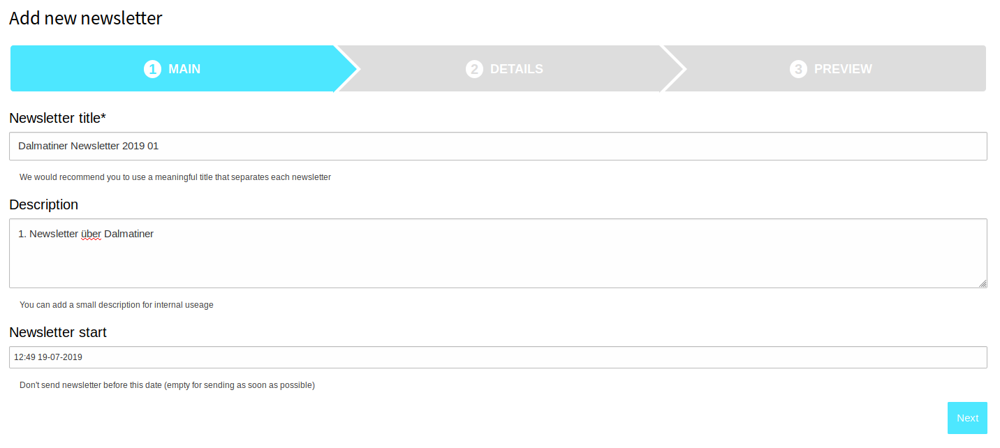
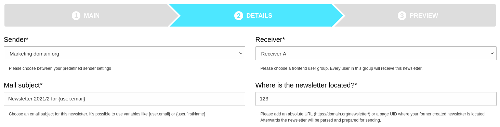
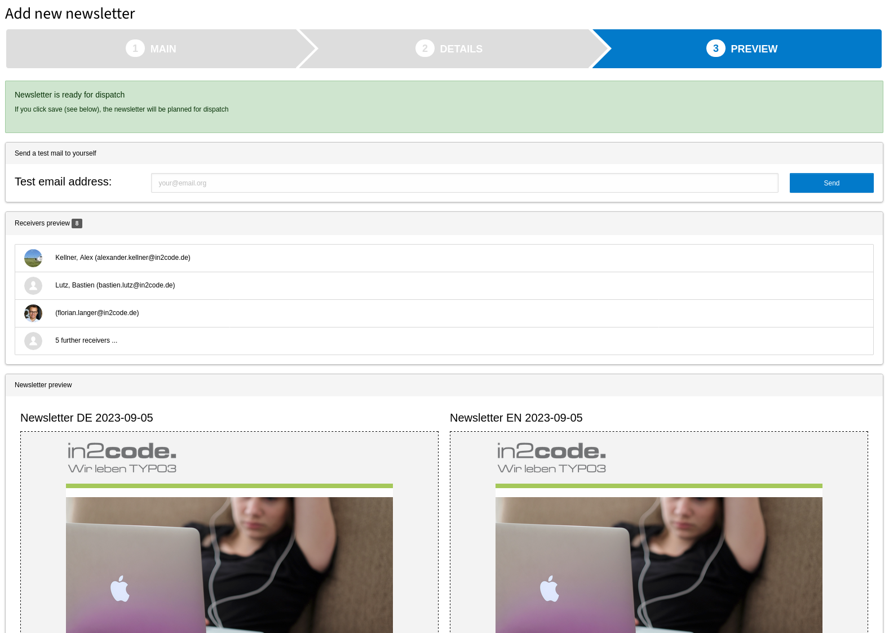
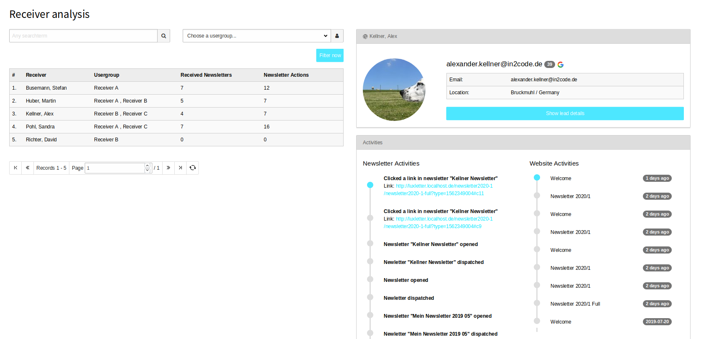
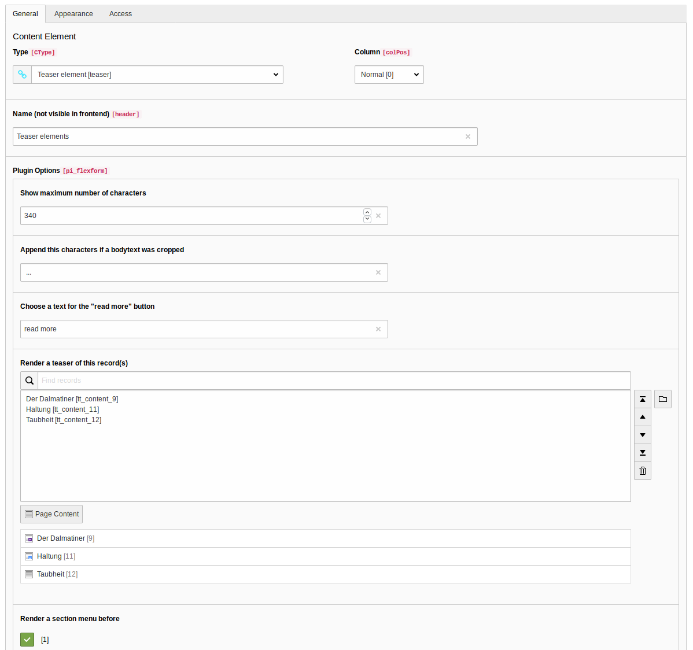

# Luxletter - Email marketing in TYPO3. Send newsletters the easy way.

Inspired by TYPO3 extension direct_mail - thank to the authors for the great work


## Introduction

Email marketing tool in TYPO3. Just build and send newsletters to your customers.
This extension does not need EXT:lux but works together with the marketing automation tool for TYPO3 to get even more
receiver analytics data.
Just add some HTML as content for your newsletters anywhere in the web or directly on your website, parse it and go for
it.


## Aspects of luxletter

### The upside

* A useful and nice **dashboard** shows you the relevant information in the backend
* Modern newsletter extension for TYPO3 10 or 11
* Tracking of clicks via **PSR-15 interface** in TYPO3
* Sending mails in queue via **symfony command controller**
* Records for **fe_groups** (and there related fe_users) are used to send mails to
* An **unsubscribe plugin** is already included
* A **teaser content element** helps you to create newsletters out of default content elements in TYPO3
* Every website can be used as prototype for your newsletter
* A **third party mailserver** can be used for newsletters
* Since 4.0 multiple sender configuration can be saved

### The downside

* At the moment there is no bounce-management (Do you want to sponsor it? Contact us!)
* fe_users records are needed to send emails (sorry guys - no tt_address at the moment  )
* There is no registration plugin for fe_users in EXT:luxletter. Please use a different extension (like femanager) for this task


## Screenshots

Example dashboard in TYPO3 module:



Example dashboard overview:



Example newsletter im mail inbox:



Example newsletter list view:



Example newsletter creation - step 1:



Example newsletter creation - step 2:



Example newsletter creation - step 3:



See the receiver activities if you have also installed the free extension lux:



Create teasers from content elements with a teaser plugin:




## Documentation

See the full [documentation](Documentation/Index.md) (installation, configuration, newsletters and analysis)


## Technical requirements

* TYPO3 10 or 11 LTS is the basic CMS for this newsletter tool.
* EXT:lux is **not needed** to run luxletter but both extensions can work together to show more relevant information.
* This extension needs to be **installed with composer** (classic installation could work but is not supported and tested).
* fe_users in fe_groups is used to send newsletter emails to.


## Sponsored features (please get in contact to us if you want to sponsor a new feature)

* Import of fe_users from tt_address (to migrate easier from direct_mail to luxletter)
* Editview of existing newsletters (reparse function?)


## Installation with composer

```
composer require "in2code/luxletter"
```


## Breaking changes !!!

### Upgrade to 8.x

Container HTML template is now configured differently to allow a selection from editors.
While it was before 8.0 used from `templateRootPath/Mail/NewsletterContainer.html`, we can now configure a path with
more than one container template via TypoScript:

```
plugin {
  tx_luxletter_fe {
    settings {
      # Define container.html files
      containerHtml {
        path = EXT:yoursitepackage/Resources/Private/Templates/Mail/
        options {
          1 {
            label = LLL:EXT:yoursitepackage/Resources/Private/Language/locallang_db.xlf:newsletter.layouts.1
            fileName = MyContainer1.html
          }
          2 {
            label = My Layout 2
            fileName = MyContainer2.html
          }
        }
      }
    }
  }
}
```

**Note:** Already existing newsletters without new layout property will not be send any more!


### Upgrade to 5.x

This is only a small breaking change. CSS files are included via TypoScript now. So we removed the partial ZurbCss.html
and put all css now to EXT:luxletter/Resources/Private/Css/.
Todo: Remove the partial call in NewsletterContainer.html template file.


### Upgrade to 4.x

Multiple senders can now be defined in records, in addition it's not needed to define a domain in extension configuration
any more. We now look into site configuration. But that change needs you to adjust some stuff.

Breaking changes in detail and what you have to do step by step after you have updated the extension:

* Add one (ore more) record(s) with sender information on any sysfolder
* Update your site configuration with an unsubscribe pid (so you could use different unsubscribe plugins now)
* Take care that your base (Entry point) settings in site configuration is not just `/` but a full domain prefix like `https://www.domain.org/`
* Create new newsletter records with the new sender configuration. **Note:** Old newsletters won't be queued any more because a sender configuration is missing
* Update your HTML template files (compare your files with `EXT:luxletter/Resources/Private/Templates/Mail/NewsletterContainer.html`)
  * If you are using the viewhelper `luxletter:mail.getUnsubscribeUrl` now another argument must be passed: `site` - example: `{luxletter:mail.getUnsubscribeUrl(newsletter:newsletter,user:user,site:site)}`
  * If you are usint the viewhelper `luxletter:configuration.getDomain` also `site` must be passed as argument - example: `{luxletter:configuration.getDomain(site:site)}`
  * If you have changed the TrackingPixel.html partial file, take also care that `site` is now passed to `luxletter:mail.getTrackingPixelUrl` - example: `{luxletter:mail.getTrackingPixelUrl(newsletter:newsletter,user:user,site:site)}`


## Changelog

| Version    | Date        | State      | Description                                                                                                                                                                                |
| ---------- | ----------- | ---------- | ------------------------------------------------------------------------------------------------------------------------------------------------------------------------------------------ |
| 9.0.1      | 2021.11.03  | Bugfix     | Mainly a documentation update, also added a _blank to "go enterprise" link                                                                                                                 |
| 9.0.0      | 2021.11.01  | Feature    | Create newsletters from CLI or scheduler task now (if needed to automaticly create frequently newsletters - e.g. every week)                                                               |
| !!! 8.0.0  | 2021.10.29  | Feature    | Different newsletter layouts can now be selected from the editor                                                                                                                           |
| 7.1.0      | 2021.10.27  | Task       | Fix date converting problem when adding newsletters with a date, add confirm message when deleting newsletters, update source description                                                  |
| 7.0.0      | 2021.10.27  | Feature    | Add a fluidStyleMailContent template for EXT:news listview, hide unwanted tables in backend list view, fix label                                                                           |
| 6.0.1      | 2021.10.21  | Bugfix     | Reanimate unsubscribe link, year and tracking pixel                                                                                                                                        |
| 6.0.0      | 2021.10.17  | Task       | Support TYPO3 11 (and also 10)                                                                                                                                                             |
| 5.0.1      | 2021.10.10  | Bugfix     | Don't include removed ZerbCss.html any more in version 5                                                                                                                                   |
| !!! 5.0.0  | 2021.10.06  | Feature    | Adding css inline in html-tags now (see TypoScript setup how to include your css files)                                                                                                    |
| 4.3.0      | 2021.10.01  | Feature    | Improve signals in ParseNewsletterUriService class, small cleanup                                                                                                                          |
| 4.2.0      | 2021.08.30  | Feature    | Add some more signals, make ParseNewsletterService more extendable, use better method to get base from site configuration, add .gitattributes file                                         |
| 4.1.1      | 2021.08.12  | Bugfix     | Don's throw an error if dashboard is not available                                                                                                                                         |
| 4.1.0      | 2021.07.27  | Feature    | Add automatic tests with github actions                                                                                                                                                    |
| !!! 4.0.0  | 2021.06.10  | Feature    | Multiple sender configuration supported (see breaking changes above), Testmails can be send multiple times, TYPO3 9 support finally dropped                                                |
| 3.1.4      | 2021.06.04  | Bugfix     | Allow rendering of widgets without EXT:lux                                                                                                                                                 |
| 3.1.3      | 2021.04.29  | Task       | Pass arguments in signal as reference                                                                                                                                                      |
| 3.1.2      | 2021.03.17  | Task       | Add extension key to composer.json                                                                                                                                                         |
| 3.1.1      | 2021.01.19  | Bugfix     | Prevent exception on missing links in middleware                                                                                                                                           |
| 3.1.0      | 2021.01.10  | Feature    | Autoreleases to TER added, small bugfix with deleted receivers                                                                                                                             |
| !!! 3.0.0  | 2020.12.17  | Feature    | templateRootPaths for content element rendering increased from 10 to 100 - please update your TypoScript! Signal added, show correct number of receivers, Some other smaller bugfixes      |
| 2.4.0      | 2020.07.10  | Feature    | Settings and variables can be used via TS, fix possible charset and parsing problems                                                                                                       |
| 2.3.0      | 2020.05.10  | Task       | Support lux 8.0.0 now                                                                                                                                                                      |
| 2.2.2      | 2020.04.23  | Bugfix     | Fix problem "Table tx_luxletter_domain_model_user doesn't exist" in links from newsletters                                                                                                 |
| 2.2.1      | 2020.04.22  | Bugfix     | Fix CSS class in backend module, fix possible problem with template orderings                                                                                                              |
| 2.2.0      | 2020.04.20  | Task       | Update for TYPO3 10.4 LTS                                                                                                                                                                  |
| 2.1.0      | 2020.03.29  | Feature    | User real receiver name in mails, Add API functions to send existing newsletters to new registered users                                                                                   |
| 2.0.1      | 2020.03.23  | Bugfix     | Prevent exception direct after a new installation when configuration was not yet changed                                                                                                   |
| 2.0.0      | 2020.03.21  | Task       | Update for TYPO3 10 and lux 7, Add widgets to TYPO3 dashboard, Support Mailmessage in TYPO3 9+10                                                                                           |
| 1.2.3      | 2020.03.19  | Task       | Pass value by reference in signal to change newsletter content                                                                                                                             |
| 1.2.2      | 2019.12.11  | Bugfix     | Don't stop sending if there are users without email address in the receiver group                                                                                                          |
| 1.2.1      | 2019.11.26  | Bugfix     | Fix problem on packagist.org                                                                                                                                                               |
| 1.2.0      | 2019.11.26  | Task       | Show helpful messages in some exceptional cases. Use mediumtext for bodytext for more space now.                                                                                           |
| 1.1.1      | 2019.09.19  | Bugfix     | Don't throw an exception for empty fe_users.crdate fields                                                                                                                                  |
| 1.1.0      | 2019.08.20  | Bugfix     | Some css fixes, Fix for default image and small code cleanup                                                                                                                               |
| 1.0.0      | 2019.08.02  | Task       | First stable TER release with a useful documentation                                                                                                                                       |
| 0.3.0      | 2019.07.31  | Task       | Support for lux, Add signal, Receiver module                                                                                                                                               |
| 0.2.0      | 2019.07.13  | Task       | Fix for PHP 7.3, Fix for default sql mode setting, documentation update                                                                                                                    |
| 0.1.0      | 2019.07.10  | Task       | Initial release of a working newsletter extension                                                                                                                                          |


## Need help with email-marketing or marketing automation?

The company behind Lux, LuxLetter and LuxEnterprise - the complete marketing box for TYPO3 - is looking
forward to help you: https://www.in2code.de
