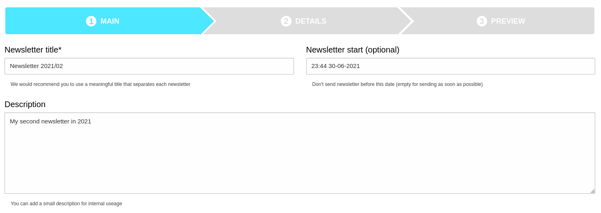
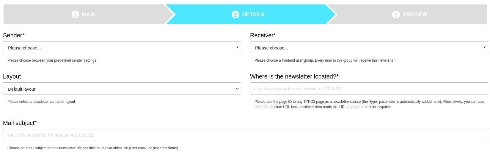

# Luxletter - Email marketing in TYPO3. Send newsletters the easy way.

Inspired by TYPO3 extension direct_mail - thank you for your work


## Introduction

Email marketing tool in TYPO3. Just build and send newsletters to your customers.
This extension does not need EXT:lux but works together with the marketing automation tool for TYPO3 to get even more
analytics data.


## Aspects

### The upside

* A modern dashboard shows you the relevant information in the backend
* Modern newsletter extension for TYPO3 9
* Tracking of clicks via PSR-15 interface in TYPO3
* Sending mails in queue via symfony command controller
* Records for fe_groups (and there related fe_users) are used to send mails to
* An unsubscribe plugin is already included
* A teaser content elements helps you to create newsletters out of default content elements in TYPO3
* Every website can be used as prototype for your newsletter
* A third party mailserver can be used for newsletters

### The downside

* At the moment there is no bounce-management (Do you want to sponsor it? Contact us!)
* There is no registration plugin for fe_users in EXT:luxletter. Please use a different extension (like femanager) for this task


## Screenshots

Example dashboard overview:


Example newsletter im mail inbox:


Example newsletter list view:


Example newsletter creation - step 1:



Example newsletter creation - step 2:



Example newsletter creation - step 3:


Create teasers from content elements with a teaser plugin:


## Documentation

See the full [documentation](Documentation/Index.md) (installation, configuration, newsletters and analysis)


## Technical requirements

* TYPO3 9 LTS is the basic CMS for this newsletter tool.
* EXT:lux is **not needed** to run luxletter but both extensions can work together to show more relevant information.
* This extension needs to be installed with composer (classic installation could work but is not supported).
* fe_users records are used to send emails to while fe_groups is used to select a group of them


## Installation with composer

```
composer require "in2code/luxletter"
```

## Changelog

| Version    | Date        | State      | Description                                                                        |
| ---------- | ----------- | ---------- | ---------------------------------------------------------------------------------- |
| 0.3.0      | 2019.07.31  | Task       | Support for lux, Add signal, Receiver module                                       |
| 0.2.0      | 2019.07.13  | Task       | Fix for PHP 7.3, Fix for default sql mode setting, documentation update            |
| 0.1.0      | 2019.07.10  | Task       | Initial release of a working newsletter extension                                  |


## Todos

* done: Mail queue
* done: Configuration for sendervalues
* done: Link-rewriting for tracking via psr-15 (and disabling via data-attribute)
* done: Trackingpixel for openrate
* done: Unsubscribe-Plugin
* done: Dashboard
* done: New CType teaser to build newsletters with content elements
* done: HTML for newsletter optimization
* done: lux: identification with email clicks (with lux 5.0.0)
* in progress: lux: new view in backend with all email receivers and there newsletter actions
* in progress: lux: show email actions in normal detail view?
* Documentation (how to build newsletters, basic configuration, what can lux do, etc...)


### Todos for later

* Embed images in mails?
* Catch bounce mails?
* HTML for EXT:news in newsletter?


## Need help with email-marketing or marketing automation?

The company behind Lux, LuxLetter and LuxEnterprise - the complete marketing box for TYPO3 - is looking 
forward to help you: https://www.in2code.de
